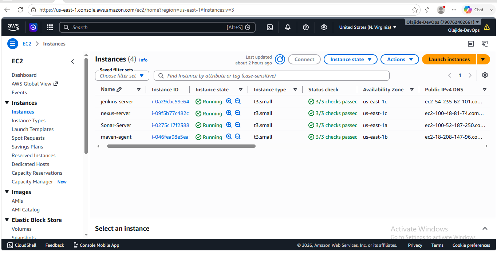
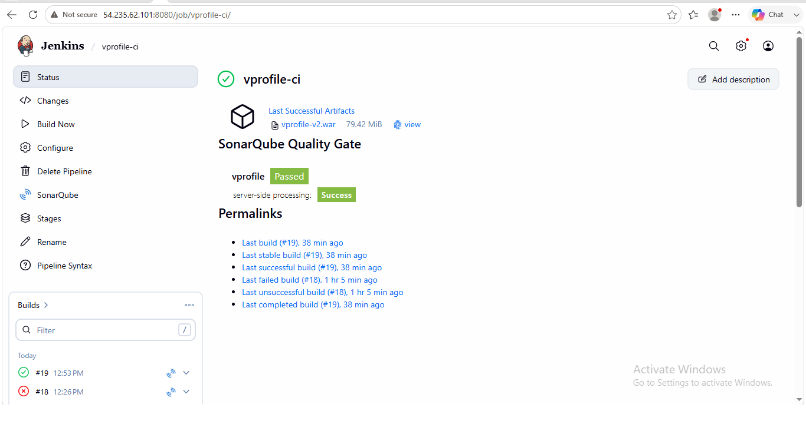
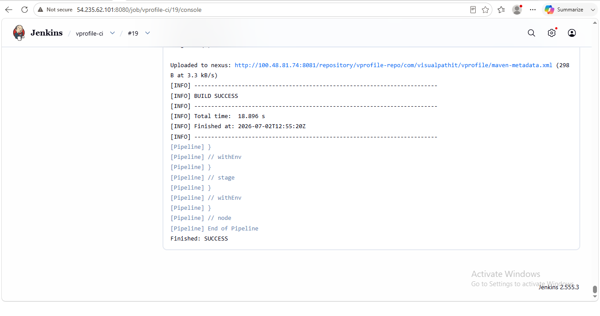
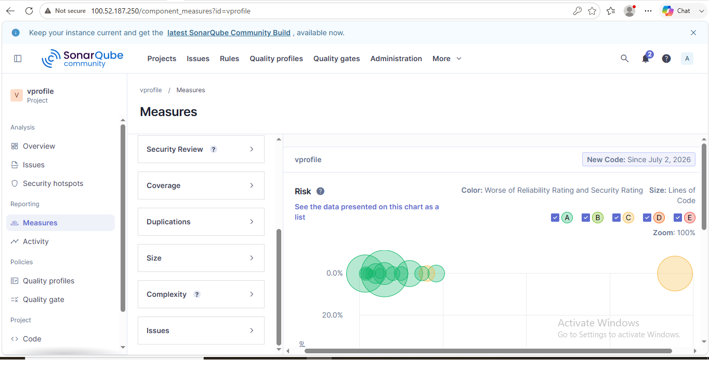
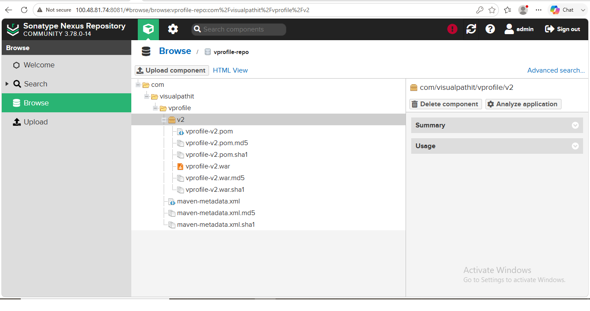

# 🚀 Enterprise CI Pipeline with Jenkins, SonarQube & Nexus Repository on AWS

## 📖 Project Overview

This project demonstrates the implementation of an enterprise-grade Continuous Integration (CI) pipeline for the VProfile Java web application using *Jenkins Pipeline as Code* on Amazon Web Services (AWS).

The pipeline automates the software build lifecycle by retrieving source code from a Git repository, compiling the application with Apache Maven, performing static code analysis with Checkstyle, analyzing code quality using SonarQube, enforcing a Quality Gate, generating a deployable WAR artifact, archiving the build output, and publishing versioned artifacts to a Nexus Repository Manager.

The CI workflow was implemented using a Jenkins Pipeline script configured directly within Jenkins. The pipeline executed the Maven deployment command:

text
mvn clean deploy -DskipTests --settings /var/lib/jenkins/.m2/settings.xml

Upon successful execution, Jenkins produced a *BUILD SUCCESS* status and automatically published the generated artifacts, including the WAR package, POM file, Maven metadata, and checksum files, to the configured Nexus repository.

This project demonstrates practical experience in Continuous Integration (CI), Pipeline as Code, build automation, artifact management, static code analysis, and enterprise DevOps practices using AWS-hosted infrastructure.

## 🎯 Business Objective

The primary objective of this project was to design and implement an enterprise-grade Continuous Integration (CI) pipeline that automates the software build and quality assurance process for a Java web application.

The solution was developed to eliminate manual build activities by integrating source code management, automated compilation, static code analysis, quality gate validation, artifact generation, and centralized artifact storage into a single, repeatable pipeline.

By incorporating Jenkins Pipeline as Code, SonarQube, Maven, Checkstyle, and Nexus Repository Manager, the project demonstrates how modern DevOps practices improve software quality, build consistency, release readiness, and development efficiency while supporting scalable and reliable CI workflows on AWS infrastructure.

## 🏗️ Solution Architecture

The solution implements an enterprise-style Continuous Integration (CI) pipeline using Jenkins Pipeline as Code, SonarQube, Nexus Repository Manager, and AWS EC2 infrastructure. The pipeline automates source code retrieval, application build, code quality inspection, artifact generation, and artifact publishing while distributing responsibilities across dedicated infrastructure components.

---

### Architecture Diagram

text
                           Developer
                               │
                               ▼
                     GitHub Repository
                         (local branch)
                               │
                               ▼
          Jenkins Controller (AWS EC2 - Amazon Linux 2023)
                               │
                               ▼
                 Jenkins Pipeline (Pipeline as Code)
                               │
                               ▼
              Maven Build Agent (AWS EC2 - Ubuntu)
                               │
        ┌──────────────────────┼──────────────────────┐
        ▼                      ▼                      ▼
 Source Code Build       Checkstyle Analysis     Unit Tests
        │
        ▼
 SonarQube Server (AWS EC2 - Ubuntu 24.04)
        │
 PostgreSQL Database
        │
        ▼
 Quality Gate Validation
        │
        ▼
 WAR Artifact Generation
        │
        ▼
 Artifact Archiving
        │
        ▼
 Nexus Repository Manager
 (AWS EC2 - Amazon Linux 2023)
        │
        ▼
 BUILD SUCCESS

---

### Architecture Components

#### GitHub Repository
Hosts the VProfile Java application source code. Jenkins retrieves the latest code from the *local* branch before initiating the pipeline.

#### Jenkins Controller
Runs on an Amazon Linux 2023 EC2 instance and orchestrates the entire CI pipeline, including source code checkout, pipeline execution, build coordination, and integration with external DevOps tools.

#### Maven Build Agent
A dedicated Jenkins Agent (maven-agent) responsible for executing Maven build tasks, allowing build workloads to be distributed away from the Jenkins Controller.

#### SonarQube Server
Deployed on an Ubuntu 24.04 EC2 instance to perform static code analysis, evaluate code quality, detect bugs and code smells, and enforce Quality Gate validation before artifact publication.

#### PostgreSQL Database
Installed on the same EC2 instance as SonarQube to provide persistent storage for project analysis data, quality metrics, and historical scan results.

#### Nexus Repository Manager
Hosted on an Amazon Linux 2023 EC2 instance to centrally store versioned Maven artifacts, including WAR files, POM files, metadata, and checksum files generated by the pipeline.

#### Nginx Reverse Proxy
Configured in front of the SonarQube server to provide secure and reliable HTTP access while acting as a reverse proxy for incoming client requests.

---

### Solution Flow

1. Developer pushes source code to the GitHub repository.
2. Jenkins Pipeline checks out the *local* branch from GitHub.
3. The pipeline dispatches the build to the dedicated *maven-agent*.
4. Maven compiles the application and resolves project dependencies.
5. Unit tests and Checkstyle analysis are executed.
6. SonarQube performs static code analysis and evaluates the configured Quality Gate.
7. Upon successful validation, Jenkins generates and archives the WAR artifact.
8. The pipeline publishes the versioned artifacts to the Nexus Repository Manager.
9. Jenkins reports a final *BUILD SUCCESS*, confirming successful completion of the CI workflow.

## 🛠️ Technology Stack

The enterprise CI pipeline was implemented using industry-standard DevOps tools and AWS infrastructure. Each component plays a specific role in automating the build, code quality analysis, and artifact management process.

| Category | Technology | Version |
|----------|------------|---------|
| Cloud Platform | Amazon Web Services (AWS EC2) | - |
| CI Server | Jenkins | 2.516.1 |
| Pipeline | Jenkins Pipeline (Pipeline as Code) | - |
| Build Tool | Apache Maven | 3.9.14 |
| Programming Language | Java (OpenJDK) | 17 |
| Source Code Management | Git | 2.43.x |
| Code Repository | GitHub | - |
| Static Code Analysis | SonarQube Community Build | 25.x |
| Sonar Scanner | SonarScanner | Installed on Maven Agent |
| Artifact Repository | Nexus Repository OSS | 3.83.1-01 |
| Code Style Analysis | Checkstyle | Maven Plugin |
| Database | PostgreSQL | SonarQube Backend Database |
| Operating System | Amazon Linux 2023 | Jenkins Controller, Maven Agent, Nexus Server |
| Operating System | Ubuntu 24.04 LTS | SonarQube Server |
| Reverse Proxy | Nginx | SonarQube Reverse Proxy |

---

### Jenkins Plugins Used

The following Jenkins plugins were configured to support the Continuous Integration pipeline:

- Pipeline
- Git
- Maven Integration
- SonarQube Scanner
- SSH Build Agents
- Credentials
- Pipeline Utility Steps

---

### Build Environment

| Component | Configuration |
|-----------|---------------|
| Jenkins Controller | Amazon Linux 2023 EC2 |
| Jenkins Build Agent | Amazon Linux 2023 EC2 |
| Build Tool | Apache Maven 3.9.14 |
| Java Version | OpenJDK 17 |
| Git Version | 2.43.x |
| SonarScanner | Installed on Maven Agent |
| Pipeline Type | Pipeline as Code |
| Pipeline Definition | Script configured directly in Jenkins |

---

### Supporting Services

| Service | Purpose |
|---------|----------|
| GitHub | Source code repository |
| Maven | Dependency management and application build |
| Checkstyle | Static code style analysis |
| SonarQube | Code quality inspection and Quality Gate validation |
| PostgreSQL | Persistent database for SonarQube |
| Nexus Repository Manager | Artifact storage and version management |
| Nginx | Reverse proxy for SonarQube |

## ☁️ AWS Infrastructure

The Continuous Integration (CI) environment was deployed on Amazon Web Services (AWS) using four dedicated Amazon EC2 instances. Each server was assigned a specific responsibility to simulate an enterprise DevOps environment with clear separation of concerns between CI orchestration, build execution, code quality analysis, and artifact management.

---

### Infrastructure Overview

| Server | Instance Name | Operating System | Instance Type | Primary Role |
|---------|---------------|------------------|---------------|--------------|
| Jenkins Controller | jenkins-server | Amazon Linux 2023 | t3.small | CI orchestration and pipeline execution |
| Maven Build Agent | maven-agent | Amazon Linux 2023 | t3.small | Executes Maven builds, Checkstyle, SonarScanner, and deployment tasks |
| SonarQube Server | Sonar-Server | Ubuntu 24.04 LTS | t3.small | Static code analysis and Quality Gate validation |
| Nexus Repository Server | nexus-server | Amazon Linux 2023 | t3.small | Centralized storage for versioned build artifacts |

---

### Infrastructure Responsibilities

#### Jenkins Controller (jenkins-server)

- Hosts Jenkins 2.516.1
- Orchestrates the complete CI pipeline
- Retrieves source code from GitHub
- Delegates build execution to the Maven Build Agent
- Archives build artifacts
- Coordinates integration with SonarQube and Nexus Repository Manager

---

#### Maven Build Agent (maven-agent)

- Dedicated Jenkins build node
- Executes Apache Maven 3.9.14 builds
- Runs Checkstyle analysis
- Executes SonarScanner
- Generates deployable WAR artifacts
- Publishes artifacts to Nexus Repository Manager

---

#### SonarQube Server (Sonar-Server)

- Hosts SonarQube Community Build 25.x
- Performs static code analysis
- Detects bugs, vulnerabilities, and code smells
- Evaluates Quality Gates
- Uses PostgreSQL as its backend database
- Exposed through Nginx Reverse Proxy

---

#### Nexus Repository Server (nexus-server)

- Hosts Nexus Repository OSS 3.83.1-01
- Stores versioned Maven artifacts
- Maintains repository metadata
- Serves as the enterprise artifact repository for future deployments

---

### Network Configuration

All EC2 instances were deployed within the same Amazon VPC, enabling secure communication through private networking while exposing only the required management and application ports.

| Component | Configuration |
|-----------|---------------|
| Amazon VPC | Shared VPC |
| Subnets | AWS Subnets |
| Internet Gateway | Attached |
| Route Tables | Configured |
| EC2 Key Pair | Used for SSH authentication |
| Security Groups | Dedicated per server |
| Private Communication | Enabled between all instances |

---

### Security Group Configuration

| Security Group | Open Ports | Purpose |
|----------------|-----------|---------|
| jenkins-sg | 22, 8080 | SSH access and Jenkins Web UI |
| maven-agent-sg | 22 | SSH communication with Jenkins Controller |
| Sonar-SG | 22, 80, 9000 | SSH, Nginx Reverse Proxy, and SonarQube |
| Nexus-SG | 22, 8081 | SSH and Nexus Repository Manager |

---

### Jenkins Agent Configuration

| Parameter | Value |
|-----------|-------|
| Node Name | maven-agent |
| Launch Method | Launch agents via SSH |
| Remote Root Directory | /home/ec2-user |
| Executors | 1 |
| Label | maven-agent |
| Authentication | SSH private key stored in Jenkins Credentials |

---

### Infrastructure Statistics

| Resource | Quantity |
|----------|----------|
| Amazon EC2 Instances | 4 |
| Security Groups | 4 |
| Jenkins Controller | 1 |
| Jenkins Build Agents | 1 |
| SonarQube Servers | 1 |
| Nexus Repository Servers | 1 |

---

### AWS Services Utilized

- Amazon EC2
- Amazon VPC
- Amazon Subnets
- Internet Gateway
- Route Tables
- Security Groups
- EC2 Key Pairs

The infrastructure follows a distributed architecture where responsibilities are separated across dedicated servers, improving scalability, maintainability, and alignment with enterprise DevOps practices.

## 🔄 Continuous Integration (CI) Pipeline Workflow

The Continuous Integration (CI) pipeline was implemented using *Jenkins Pipeline as Code* to automate the build, testing, static code analysis, artifact generation, and artifact publication processes for the VProfile Java web application.

The pipeline is defined directly within Jenkins and executes a sequence of automated stages whenever the pipeline is triggered.

---

### Pipeline Execution Flow

text
Developer
      │
      ▼
GitHub Repository (local branch)
      │
      ▼
Jenkins Pipeline
      │
      ▼
Fetch Source Code
      │
      ▼
Maven Build
      │
      ▼
Unit Tests
      │
      ▼
Checkstyle Analysis
      │
      ▼
SonarQube Analysis
      │
      ▼
Archive WAR Artifact
      │
      ▼
Deploy Artifact to Nexus Repository
      │
      ▼
BUILD SUCCESS

---

### Pipeline Stages

#### 1. Fetch Code

Jenkins checks out the *local* branch of the VProfile application from the GitHub repository, ensuring the latest source code is available for the build process.

---

#### 2. Build

Apache Maven compiles the application, resolves project dependencies, and prepares the project for testing using:

text
mvn clean install -DskipTests

---

#### 3. Unit Test

Automated unit tests are executed using Maven to validate the application's functionality before proceeding to the analysis stages.

text
mvn test

---

#### 4. Code Analysis with Checkstyle

Checkstyle analyzes the source code against predefined coding standards and generates a report highlighting any style violations or inconsistencies.

text
mvn checkstyle:checkstyle

---

#### 5. Code Analysis with SonarQube

SonarScanner submits the application source code to SonarQube for comprehensive static code analysis, evaluating code quality, bugs, vulnerabilities, and maintainability metrics.

---

#### 6. Archive Artifact

Upon successful completion of the analysis stages, Jenkins archives the generated WAR artifact to preserve the build output for traceability and future deployment.

---

#### 7. Deploy to Nexus

The final stage publishes the generated Maven artifacts to the configured Nexus Repository Manager using the following command:

text
mvn clean deploy -DskipTests --settings /var/lib/jenkins/.m2/settings.xml

The deployment includes:

- vprofile-v2.war
- vprofile-v2.pom
- maven-metadata.xml
- MD5 checksum files
- SHA1 checksum files

---

### Pipeline Outcome

The pipeline completed successfully with a *BUILD SUCCESS* status, demonstrating a fully automated enterprise Continuous Integration workflow that integrates source code management, build automation, static code analysis, artifact archiving, and centralized artifact management.

## ⚙️ Pipeline Stage Details

Each stage of the Jenkins Pipeline was designed to automate a specific part of the software delivery lifecycle, ensuring build consistency, code quality, and reliable artifact management.

---

### Fetch Code

*Purpose*

Retrieves the latest source code from the *local* branch of the GitHub repository, ensuring that the pipeline always builds the most recent version of the application.

*Technology Used*

- Jenkins Git Plugin
- GitHub
- Git

---

### Build

*Purpose*

Compiles the Java application, resolves project dependencies from Maven Central Repository, and prepares the application for testing and packaging.

*Technology Used*

- Apache Maven 3.9.14
- Maven Compiler Plugin
- OpenJDK 17

*Command Executed*

text
mvn clean install -DskipTests

---

### Unit Test

*Purpose*

Executes automated unit tests to verify that application components behave as expected before artifact generation.

*Technology Used*

- Maven Surefire Plugin
- JUnit
- Apache Maven

*Command Executed*

text
mvn test

---

### Code Analysis with Checkstyle

*Purpose*

Performs static code style analysis to verify compliance with coding standards and identify formatting or style issues early in the development lifecycle.

*Technology Used*

- Maven Checkstyle Plugin
- Apache Maven

*Command Executed*

text
mvn checkstyle:checkstyle

---

### Code Analysis with SonarQube

*Purpose*

Analyzes the application source code to identify bugs, vulnerabilities, code smells, and maintainability issues, providing actionable insights into overall code quality.

*Technology Used*

- SonarQube Community Build 25.x
- SonarScanner
- Jenkins SonarQube Scanner Plugin

---

### Archive Artifact

*Purpose*

Archives the generated WAR artifact within Jenkins, providing traceability and making the build output available for future deployment or verification.

*Artifact Generated*

- vprofile-v2.war

---

### Deploy to Nexus Repository

*Purpose*

Publishes versioned Maven artifacts to Nexus Repository Manager, creating a centralized and reliable repository for deployment-ready application packages.

*Technology Used*

- Maven Deploy Plugin
- Nexus Repository OSS
- Apache Maven

*Command Executed*

text
mvn clean deploy -DskipTests --settings /var/lib/jenkins/.m2/settings.xml

*Artifacts Published*

- vprofile-v2.war
- vprofile-v2.pom
- maven-metadata.xml
- MD5 checksum files
- SHA1 checksum files

---

### Overall Outcome

The pipeline automated the complete Continuous Integration workflow—from source code retrieval through build, testing, static code analysis, artifact generation, and publication to Nexus Repository Manager—resulting in a successful *BUILD SUCCESS* status and deployment-ready artifacts.

## ⚙️ Jenkins, SonarQube & Nexus Configuration

The Continuous Integration environment was configured using Jenkins Global Tools, secure credentials management, SonarQube integration, Maven deployment settings, and Nexus Repository Manager to support an automated enterprise CI workflow.

---

### Jenkins Global Tool Configuration

| Tool | Configuration |
|------|---------------|
| JDK | JDK 17 (OpenJDK 17) |
| Maven | Apache Maven 3.9.14 |
| SonarScanner | SonarQube Scanner 8.1.0.6389 |

---

### Jenkins Credentials

The following credentials were configured securely within Jenkins Credentials Manager:

| Credential | Purpose |
|------------|---------|
| SonarQube Token | Authenticate Jenkins with SonarQube |
| SSH Private Key | Secure communication between Jenkins Controller and Maven Build Agent |

> *Note:* The GitHub repository is public; therefore, GitHub credentials were not required. Nexus deployment credentials were configured in the Maven settings.xml file.

---

### SonarQube Configuration

| Parameter | Value |
|-----------|-------|
| Server Name | Sonar Server |
| Authentication | Token |
| Project Key | vprofile |
| Project Name | vprofile |

> *Note:* In public documentation, consider replacing the server URL with a placeholder (for example, http://<SONARQUBE_SERVER_IP>) if the instance is no longer intended to be publicly accessible.

---

### Nexus Repository Configuration

| Parameter | Value |
|-----------|-------|
| Repository Name | vprofile-repo |
| Repository Format | Maven2 |
| Repository Type | Hosted |
| Artifact Name | VProfile |
| Artifact Version | v2 |
| Deployment Method | Maven settings.xml |

---

### Maven Configuration

| Parameter | Value |
|-----------|-------|
| Custom Settings File | Yes |
| Settings File Location | /var/lib/jenkins/.m2/settings.xml |

The custom Maven settings file stores the repository configuration and deployment credentials required to publish artifacts to Nexus Repository Manager.

---

### Jenkins Job Configuration

| Parameter | Value |
|-----------|-------|
| Job Name | vprofile-ci |
| Pipeline Type | Declarative Pipeline |
| Pipeline Definition | Pipeline Script |
| Build Trigger | Manual |

---

### Build Agent Configuration

| Parameter | Value |
|-----------|-------|
| Agent Label | maven-agent |
| Launch Method | SSH Agent |

The Jenkins Controller delegates build execution to the dedicated Maven Build Agent, enabling distributed build execution and reducing workload on the controller.

---

### Artifact Archiving

| Parameter | Value |
|-----------|-------|
| Artifact Archiving | Enabled |
| Artifact Pattern | **/target/*.war |

Jenkins archives the generated WAR artifact after a successful build, ensuring traceability and making the build output available for future deployment or verification.

---

### Build Result

The pipeline completed successfully with a *BUILD SUCCESS* status and published the following artifacts to the Nexus Repository Manager:

- vprofile-v2.war
- vprofile-v2.pom
- maven-metadata.xml
- MD5 checksum files
- SHA1 checksum files

This configuration demonstrates secure credential management, centralized tool configuration, automated artifact publication, and enterprise Continuous Integration practices using Jenkins, SonarQube, Maven, and Nexus Repository Manager.

## 📁 Repository Structure

This repository is a fork of the original *hkhcoder/vprofile-project* repository and has been customized to support this enterprise Continuous Integration (CI) implementation. It contains the VProfile Java application source code, Maven project configuration, Jenkins pipeline definition, automation resources, and project documentation.

During this implementation, the CI pipeline was executed using a *Pipeline Script configured directly in Jenkins. A Jenkinsfile is also present in the repository but was **not used as the pipeline source* for this implementation.

text
vprofile-project/
│
├── ansible/
├── src/
│   ├── main/
│   └── test/
├── vagrant/
├── pom.xml
├── Jenkinsfile
├── README.md
│
└── Project source code

---

### Repository Customizations

- Forked from *hkhcoder/vprofile-project*
- Updated pom.xml to configure Maven artifact deployment to Nexus Repository Manager
- Updated Nexus repository configuration for the current environment
- Updated project documentation (README.md)
- Retained the repository Jenkinsfile while implementing the CI pipeline using a Pipeline Script configured directly in Jenkins

---

### Directory Overview

| Directory / File | Description |
|------------------|-------------|
| ansible/ | Ansible automation resources included with the project |
| src/main | Application source code |
| src/test | Unit test source code |
| vagrant/ | Vagrant environment configuration files |
| pom.xml | Maven project configuration, dependencies, plugins, and deployment settings |
| Jenkinsfile | Jenkins Pipeline as Code definition retained in the repository. This implementation used a Pipeline Script configured directly in Jenkins. |
| README.md | Project documentation |

---

### Build Output

The Jenkins pipeline generated a deployable WAR artifact and published it to Nexus Repository Manager instead of storing build outputs in the GitHub repository.

*Artifacts Published*

- vprofile-v2.war
- vprofile-v2.pom
- maven-metadata.xml
- MD5 checksum files
- SHA1 checksum files

---

### DevOps Best Practice

The project follows enterprise DevOps best practices by keeping application source code under version control in GitHub while storing generated build artifacts in a centralized Nexus Repository Manager. This approach provides artifact versioning, traceability, consistency across environments, and reliable deployment readiness.

## 📸 Project Screenshots

The following screenshots provide visual evidence of the enterprise Continuous Integration (CI) pipeline implementation, from AWS infrastructure provisioning through code quality analysis to successful artifact publication.

---

### 1. AWS Infrastructure

The CI environment consists of four dedicated Amazon EC2 instances hosting the Jenkins Controller, Maven Build Agent, SonarQube Server, and Nexus Repository Manager.

---

### 2. Jenkins Pipeline Execution

Successful execution of the Jenkins Declarative Pipeline demonstrating automated source code checkout, build, testing, code analysis, artifact archiving, and deployment.

---

### 3. Jenkins Console Output

Jenkins Console Output confirming successful execution of all pipeline stages, completion of artifact deployment to Nexus Repository Manager, and final *BUILD SUCCESS* status.

---

### 4. SonarQube Project Dashboard

SonarQube project dashboard displaying the *vprofile* project, latest analysis, Quality Gate status, and overall project health.

---

### 5. SonarQube Code Quality Analysis

Detailed static code analysis results including security, reliability, maintainability, bugs, vulnerabilities, code smells, test coverage, and code duplication metrics.

---

### 6. Nexus Repository Manager

Nexus Repository Manager displaying the published Maven artifacts generated by the Jenkins CI pipeline, including the deployable WAR package, POM file, Maven metadata, and checksum files.

## 🛠️ Skills Demonstrated

This project demonstrates practical experience in designing, implementing, and documenting an enterprise Continuous Integration (CI) pipeline using industry-standard DevOps tools and AWS cloud infrastructure.

### DevOps Practices

- Continuous Integration (CI)
- Pipeline as Code concepts
- Build Automation
- Static Code Analysis
- Artifact Management
- Distributed Build Architecture
- Source Code Management
- Infrastructure Documentation
- CI Pipeline Orchestration

---

### Cloud & Infrastructure

- Amazon EC2
- Amazon VPC
- AWS Security Groups
- EC2 Key Pairs
- Private Network Communication
- Linux Server Administration

---

### CI/CD & Automation

- Jenkins
- Declarative Pipeline
- Jenkins Build Agents
- Maven Build Automation
- SonarScanner
- Nexus Repository Manager

---

### Software Quality

- Unit Testing
- Maven Surefire Plugin
- Checkstyle
- SonarQube Static Code Analysis
- Quality Reporting

---

### Development Tools

- Git
- GitHub
- Apache Maven
- OpenJDK 17
- Bash Shell

---

### Operating Systems

- Amazon Linux 2023
- Ubuntu 24.04 LTS

---

### Professional Competencies

- Enterprise CI Pipeline Design
- Build Troubleshooting
- Secure Credential Management
- Artifact Versioning
- Code Quality Management
- Technical Documentation
- DevOps Best Practices

## 🏆 Key Achievements

The successful completion of this project demonstrates the implementation of an enterprise-style Continuous Integration (CI) solution using modern DevOps tools and AWS cloud infrastructure.

### Project Achievements

- Successfully designed and implemented an enterprise Continuous Integration (CI) pipeline using Jenkins Declarative Pipeline.
- Automated source code retrieval from a GitHub repository.
- Built and packaged the VProfile Java application using Apache Maven.
- Executed automated unit testing with the Maven Surefire Plugin.
- Performed static code analysis using Checkstyle and SonarQube.
- Generated and archived deployable WAR artifacts within Jenkins.
- Published versioned Maven artifacts to Nexus Repository Manager.
- Implemented a distributed build architecture using a dedicated Jenkins Maven Build Agent.
- Hosted the complete CI environment on Amazon EC2 instances.
- Configured secure authentication using Jenkins Credentials and SSH private keys.
- Integrated SonarQube for continuous code quality inspection.
- Applied enterprise DevOps best practices for artifact management and build automation.
- Successfully completed the pipeline with a *BUILD SUCCESS* status and verified artifact publication to Nexus Repository Manager.

---

### Project Outcome

This implementation demonstrates practical experience in Continuous Integration, build automation, code quality analysis, artifact repository management, Linux administration, and AWS infrastructure provisioning. The completed solution reflects an enterprise-oriented CI workflow suitable for modern DevOps environments.

## 🔧 Troubleshooting & Lessons Learned

During the implementation of the Enterprise Continuous Integration (CI) Pipeline, several technical challenges were encountered and resolved. The following summarizes the key issues, root causes, and solutions applied throughout the project.

### Troubleshooting Summary

| Issue | Root Cause | Resolution |
|-------|------------|------------|
| Unable to SSH into the SonarQube EC2 instance | Security Group rules did not allow SSH access | Updated the Security Group to allow inbound TCP port 22 from the appropriate source and verified connectivity. |
| SonarQube service failed to start | Insufficient system memory on the EC2 instance | Created and enabled a 2 GB swap file to provide additional virtual memory before restarting the service. |
| SonarQube authentication failed (HTTP 401 Unauthorized) | Expired or incorrect SonarQube token configured in Jenkins | Generated a new SonarQube token and updated the Jenkins credential used by the pipeline. |
| Maven deployment to Nexus timed out | Jenkins was using an outdated Nexus Repository server IP address | Updated the Nexus repository URL in the project's pom.xml, committed the change to GitHub, and reran the pipeline successfully. |
| Jenkins pipeline failed during artifact deployment | Maven attempted to deploy to an unreachable Nexus endpoint | Corrected the deployment configuration and successfully redeployed the artifact. |
| SonarQube dashboard was inaccessible | Nginx reverse proxy configuration had not been completed | Configured Nginx as a reverse proxy, validated the configuration using nginx -t, and reloaded the service. |
| PostgreSQL backend configuration | SonarQube database and user had not yet been configured | Created the sonar database user, created the sonarqube database, and configured the JDBC connection in sonar.properties. |
| Jenkins pipeline execution failed | Pipeline configuration issues were identified during execution | Reviewed the Jenkins Console Output, corrected the configuration, and reran the pipeline until it completed successfully. |

---

## 📚 Lessons Learned

This project provided practical experience in designing, configuring, troubleshooting, and operating a production-style Continuous Integration (CI) pipeline on Amazon Web Services (AWS).

### Technical Lessons

- Built a multi-server CI environment using dedicated Amazon EC2 instances for Jenkins, Maven Build Agent, SonarQube, and Nexus Repository Manager.
- Configured Jenkins to execute builds remotely through an SSH-connected build agent.
- Integrated GitHub, Jenkins, Maven, Checkstyle, SonarQube, and Nexus Repository Manager into a complete CI workflow.
- Performed automated static code analysis using Checkstyle and SonarQube.
- Published versioned build artifacts to a centralized Nexus Repository Manager instead of storing build outputs in GitHub.
- Configured PostgreSQL as the backend database for SonarQube.
- Configured Nginx as a reverse proxy for secure access to SonarQube.
- Used Apache Maven to build, test, analyze, package, archive, and deploy the application.
- Managed Jenkins credentials securely using token-based authentication and SSH private keys.
- Updated project configuration files, including pom.xml, to reflect infrastructure and deployment changes.

### DevOps Best Practices

- Separate application source code from generated build artifacts.
- Store build outputs in a centralized artifact repository to support versioning and future deployments.
- Keep credentials outside application source code whenever possible.
- Validate service configurations before restarting production services.
- Use Jenkins Console Output to troubleshoot and resolve pipeline failures.
- Track infrastructure-related configuration changes using version control.
- Validate each pipeline stage independently before executing the complete CI workflow.

### Key Outcomes

- Successfully implemented an end-to-end Enterprise Continuous Integration (CI) pipeline.
- Automated source code retrieval, application compilation, unit testing, static code analysis, artifact archiving, and artifact deployment.
- Successfully integrated GitHub, Jenkins, Maven, Checkstyle, SonarQube, and Nexus Repository Manager into a unified CI solution.
- Produced a reusable enterprise CI pipeline that provides a strong foundation for future Continuous Delivery (CD), containerization, and deployment automation initiatives.

## 🚀 Future Enhancements

This project establishes a solid foundation for a production-ready CI platform. Future enhancements will extend the solution into a complete Continuous Delivery (CD) and cloud-native DevOps pipeline.

### Planned Improvements

- Implement Continuous Delivery (CD) for automated application deployments.
- Containerize the VProfile application using Docker.
- Build and publish Docker images to a container registry.
- Deploy containerized workloads to Amazon ECS.
- Extend the pipeline to support Kubernetes deployments using Amazon EKS.
- Integrate GitHub Actions for repository-level CI workflows.
- Implement Infrastructure as Code (IaC) using Terraform to provision AWS infrastructure.
- Add automated security scanning using OWASP Dependency-Check and Trivy.
- Integrate Slack notifications for real-time build and deployment alerts.
- Configure automated pipeline triggers based on GitHub webhooks.
- Introduce environment-specific deployment stages for Development, Staging, and Production.
- Strengthen Jenkins authentication and authorization using Role-Based Access Control (RBAC).
- Implement artifact version promotion strategies within Nexus Repository Manager.
- Integrate automated rollback mechanisms for failed deployments.
- Add application and infrastructure monitoring using Amazon CloudWatch and Grafana.

### Long-Term Vision

The long-term objective is to evolve this implementation from an enterprise Continuous Integration (CI) solution into a fully automated, secure, scalable, and cloud-native DevOps platform that incorporates Continuous Delivery (CD), Infrastructure as Code (IaC), container orchestration, automated security validation, and comprehensive observability, following modern DevOps and Site Reliability Engineering (SRE) best practices.
